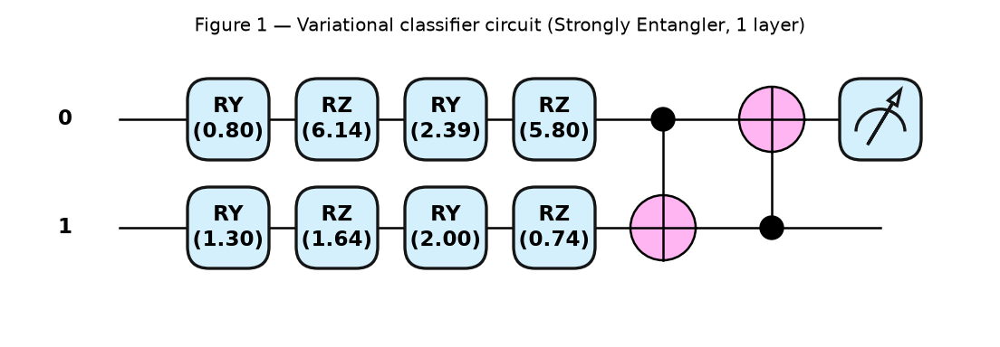
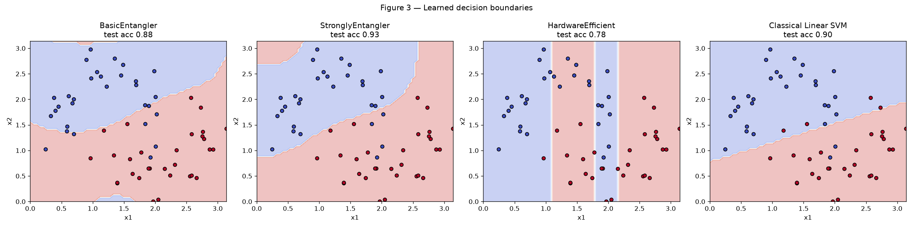
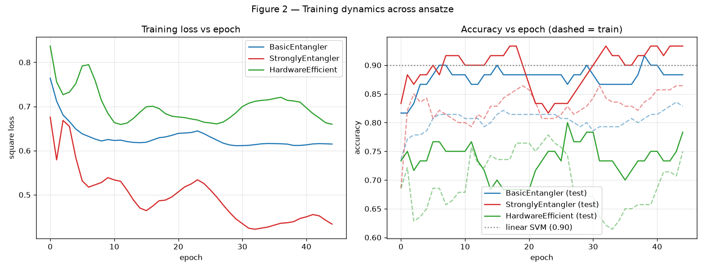
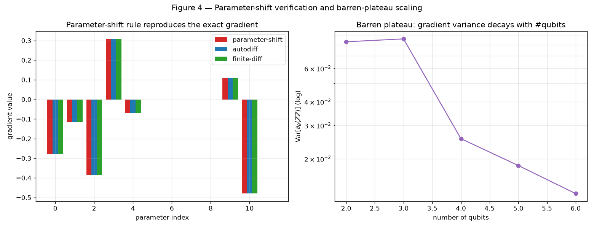

# Trainability and Expressibility of Variational Quantum Classifiers: An Ansatz Comparison

## Abstract
This project implements a **Variational Quantum Classifier (VQC)** — a parameterized quantum circuit trained end-to-end as a differentiable model — and studies how the choice of *ansatz* (the trainable circuit architecture) governs both accuracy and trainability. We compare three 2-qubit ansätze (Basic Entangler, Strongly Entangler, and a Hardware-Efficient CZ ring) on the non-linearly separable `two-moons` dataset, training via gradient descent with the **parameter-shift rule**. The Strongly Entangler achieves $93.3\%$ test accuracy, exceeding the classical linear baseline ($90.0\%$) and approaching a tuned classical RBF kernel ($95.0\%$), while the more expressive Hardware-Efficient ansatz collapses to $78.3\%$ — a concrete trainability failure. We further (i) verify numerically that the parameter-shift rule reproduces the exact analytic gradient to machine precision ($\sim 10^{-16}$), and (ii) reproduce the **barren-plateau** phenomenon, showing the gradient variance of a random circuit decaying by $\sim 6\times$ as the register grows from 2 to 6 qubits.

---

## 1. Introduction
Where a quantum *kernel* method (Project 01) uses a fixed quantum feature map and offloads optimization to a classical SVM, a **Variational Quantum Classifier** makes the circuit itself trainable. Classical data $\vec{x}$ is encoded into qubits, transformed by a parameterized unitary $W(\vec\theta)$, and the class label is read from the expectation value of an observable. The parameters $\vec\theta$ are optimized against a loss — the quantum analogue of training a neural network.

The model output for a point $\vec{x}$ is the expectation of a Pauli-$Z$ observable on the first qubit, plus a trainable classical bias $b$:

$$f(\vec{x};\vec\theta,b) = \langle 0 | \, S^\dagger(\vec{x})\, W^\dagger(\vec\theta)\, Z_0\, W(\vec\theta)\, S(\vec{x}) \,|0\rangle + b \;\in\; [-1, 1]$$

Class predictions are $\hat{y} = \operatorname{sign} f(\vec{x})$, and we minimize the square loss against labels $y \in \{-1, +1\}$.

The central question of the VQC is not *"can it represent the boundary?"* but *"can it be trained to?"* — the tension between **expressibility** (how much of Hilbert space the ansatz can reach) and **trainability** (whether gradients are large enough to optimize). This project makes that tension measurable.

---

## 2. Methodology

### 2.1 Dataset and Encoding
We use the `two-moons` dataset ($N=200$, noise $=0.20$), a canonical non-linearly separable binary problem, scaled to $[0, \pi]$ to match rotation-gate periods. Data is loaded by **angle embedding** ($R_Y$ rotations) and *re-uploaded* before every trainable layer, so circuit depth increases the effective non-linearity of the model (cf. Project 03, Data Re-Uploading).

### 2.2 Ansätze
Three trainable blocks of increasing structure are compared (**Figure 1**):

| Ansatz | Per-qubit rotations | Entangler | Params (3 layers, 2 qubits) |
| :--- | :--- | :--- | :---: |
| **Basic Entangler** | $R_X$ | CNOT ring | 7 |
| **Strongly Entangler** | $R_Z R_Y R_Z$ | CNOT ring | 19 |
| **Hardware-Efficient** | $R_X R_Y R_Z$ | CZ ring | 19 |


*Figure 1: The variational classifier circuit (Strongly Entangler, 1 layer shown): angle encoding, trainable single-qubit rotations, and an entangling ring, measured in the Pauli-$Z$ basis.*

### 2.3 Training
Parameters are optimized with **Adam** (step $0.1$, 45 epochs, mini-batch 25) against the square loss. On real hardware, gradients are obtained by the **parameter-shift rule**:

$$\frac{\partial \langle Z \rangle}{\partial \theta_k} = \frac{1}{2}\Big[\, f\big(\theta_k + \tfrac{\pi}{2}\big) - f\big(\theta_k - \tfrac{\pi}{2}\big) \Big]$$

which is *exact* (not a finite-difference approximation) for gates of the form $e^{-i\theta P/2}$. We train on a simulator using fast backpropagation, but verify the parameter-shift equivalence explicitly (§3.3).

### 2.4 Classical Baselines
Linear and RBF SVMs are trained on the same split for reference.

---

## 3. Results

### 3.1 Classification Performance
*Table 1: Test accuracy across ansätze and classical baselines (two-moons, 30% test split).*

| Model | Trainable Params | Train Acc | Test Acc |
| :--- | :---: | :---: | :---: |
| **VQC — Strongly Entangler** | 19 | 0.864 | **0.933** |
| VQC — Basic Entangler | 7 | 0.829 | 0.883 |
| VQC — Hardware-Efficient | 19 | 0.750 | 0.783 |
| Classical RBF SVM (reference) | — | — | 0.950 |
| Classical Linear SVM (baseline) | — | — | 0.900 |

The Strongly Entangler exceeds the linear baseline and nearly matches the tuned RBF kernel — with only 19 parameters.

### 3.2 Learned Decision Boundaries

*Figure 3: The Strongly Entangler learns a smooth curved boundary tracking the moons; the Hardware-Efficient ansatz collapses to near-vertical stripes (it fails to use the entangling structure productively); the linear SVM is restricted to a straight cut.*

Training dynamics (**Figure 2**) show the Strongly Entangler driving the loss down monotonically, while the Hardware-Efficient ansatz stalls at a high-loss plateau despite having the same parameter count.


*Figure 2: Loss (left) and accuracy (right) vs. epoch. Dashed = train, solid = test. The Hardware-Efficient ansatz plateaus early — a trainability, not a capacity, failure.*

### 3.3 Parameter-Shift Rule Verification
We compare, parameter by parameter, the gradient obtained from (a) the manual parameter-shift formula, (b) PennyLane autodiff, and (c) a central finite difference. The parameter-shift and autodiff gradients agree to

$$\max_k \big| \nabla^{\text{shift}}_k - \nabla^{\text{autodiff}}_k \big| = 1.11 \times 10^{-16}$$

i.e. machine precision — confirming the rule is analytically exact, not approximate (**Figure 4**, left).

### 3.4 Barren Plateaus
We measure the variance of a single circuit gradient $\partial_\theta \langle Z_0 Z_1 \rangle$ over 60 random parameter initializations of a depth-4 hardware-efficient circuit, as a function of qubit count:

*Table 2: Gradient variance vs. register size.*

| Qubits | 2 | 3 | 4 | 5 | 6 |
| :--- | :---: | :---: | :---: | :---: | :---: |
| $\mathrm{Var}[\partial_\theta \langle ZZ\rangle]$ | $8.3{\times}10^{-2}$ | $8.6{\times}10^{-2}$ | $2.6{\times}10^{-2}$ | $1.8{\times}10^{-2}$ | $1.3{\times}10^{-2}$ |

The variance decays as the system grows (**Figure 4**, right). This is the **barren-plateau** effect: for wide, expressive circuits the loss landscape becomes exponentially flat, gradients vanish, and gradient-based training stalls — the fundamental obstacle to scaling VQCs.


*Figure 4: (Left) parameter-shift, autodiff, and finite-difference gradients coincide exactly. (Right) gradient variance decays with qubit count on a log axis — the onset of a barren plateau.*

---

## 4. Discussion
Two lessons emerge, both counter to the naïve intuition that "more expressive = better."

1. **Expressibility is not accuracy.** The Hardware-Efficient ansatz can reach *more* of Hilbert space than the Basic Entangler (same parameter count, richer gate set), yet it scored *lowest* ($78.3\%$). Its CZ-ring entanglement folds the feature space in ways the optimizer could not navigate from a random start — the loss plateaued (Figure 2) and the boundary degenerated into stripes (Figure 3). Capacity without trainability is useless.

2. **The parameter-shift rule is exact, but fragile at scale.** §3.3 confirms gradients are computed exactly on small circuits. §3.4 shows *why that guarantee is not enough*: as circuits widen, the gradients themselves shrink toward zero (barren plateaus), so even an exact estimator returns near-zero signal. This motivates the architectural choices of later projects — data re-uploading (Project 03), reservoir computing with frozen weights (Project 14), and the analytical Q-NTK treatment of trainability (Project 17).

The Strongly Entangler's success is the practical middle ground: enough entangling structure to bend the boundary around the moons, few enough parameters (19) and shallow enough depth to remain trainable.

---

## 5. How to Run
```bash
pip install pennylane scikit-learn matplotlib numpy
python variational_classifier.py
```
Outputs four figures and `results_summary.txt`. Runtime is a few minutes (the barren-plateau scan dominates, as it uses parameter-shift gradients on up to 6 qubits).

### File layout
| File | Contents |
| :--- | :--- |
| `ansatz.py` | The three trainable circuit architectures + registry |
| `qnn.py` | QNode model, square loss, accuracy, Adam training loop |
| `analysis.py` | Parameter-shift verification + barren-plateau scan |
| `variational_classifier.py` | Main experiment; trains all models, makes all figures |

---

## References
* Mitarai, K., Negoro, M., Kitagawa, M., & Fujii, K. (2018). Quantum circuit learning. *Physical Review A*, 98(3), 032309. *(parameter-shift rule)*
* Schuld, M., Bergholm, V., Gogolin, C., Izaac, J., & Killoran, N. (2019). Evaluating analytic gradients on quantum hardware. *Physical Review A*, 99(3), 032331.
* McClean, J. R., Boixo, S., Smelyanskiy, V. N., Babbush, R., & Neven, H. (2018). Barren plateaus in quantum neural network training landscapes. *Nature Communications*, 9(1), 4812.
* Schuld, M., & Killoran, N. (2019). Quantum machine learning in feature Hilbert spaces. *Physical Review Letters*, 122(4), 040504.
